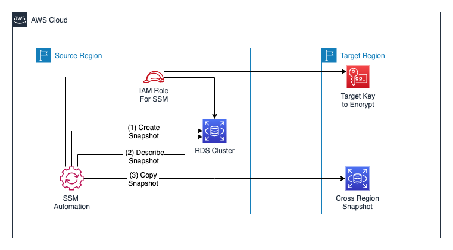

# Automate RDS Aurora Snapshots for disaster recovery

This repository contains a solution for implementing disaster recovery for Aurora database clusters by automating the process of cluster snapshot creation and copying to different AWS Regions. This process can be triggered on an ad hoc basis or on a defined schedule using either AWS Systems Manager Maintenance Windows or an Amazon CloudWatch event rule, which uses an Automation document as a target based on your RTO and RPO requirements.

The template takes four parameters - **DBClusterIdentifier** (source DB cluster ID), **KMSTargetKey** (KMS key ID in the target region), **SourceRegion** (region where DB cluster is located) and **TargetRegion** (destination region for the snapshot). Please ensure that the SourceRegion and TargetRegion parameter inputs are specified in lower case (such as us-east-1 and us-west-2).

This solution can be deployed by using this [template](SSM_automation_execute_script_CFN.yaml) and more details are available in a related [AWS Blog Post](https://aws.amazon.com/blogs/mt/automate-rds-aurora-snapshots-for-disaster-recovery/)

## License

This library is licensed under the MIT-0 License. See the LICENSE file.
